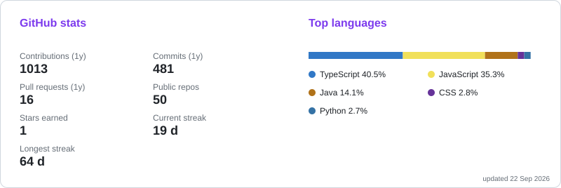

  <picture>
    <source media="(prefers-color-scheme: dark)" srcset="assets/dark.svg">
    <source media="(prefers-color-scheme: light)" srcset="assets/light.svg">
    
  </picture>

  

  
  
  
  

<table>
  <tr>
    <td width="55%" valign="top">

<h2>About</h2>

- 🎓 3rd-year B.Tech CSE at <strong>SJCET Palai</strong> (graduating 2028)
- 🎯 Targeting machine learning engineering roles at product companies
- 🔬 Studying how noise affects model generalization (HTRU2 pulsar data)
- 🏆 1st place, TechThrive hackathon: 125+ teams, 24 hours

</td>
<td width="45%" valign="top">

<h2>Currently</h2>

🧠 <strong>Interning:</strong> Machine Learning at FlyRank 
🔧 <strong>Building:</strong> AquaGuard, an STM32 + ESP32 water-tank monitor with a PWA dashboard 
📚 <strong>Practicing:</strong> DSA on LeetCode 
🤝 <strong>Open to:</strong> ML / SWE internships, 2027

</td>
</tr>
</table>

## Tech Stack

  

---

## Machine Learning

| Project | What it does | Stack |
| --- | --- | --- |
| [logistic_regression_mle_map_l1_l2](https://github.com/Keerthana-G-Pillai/logistic_regression_mle_map_l1_l2) | Compares MLE and MAP (L1, L2) logistic regression on the Breast Cancer Wisconsin dataset | Python, scikit-learn |
| [Linear-Regression-California-Housing](https://github.com/Keerthana-G-Pillai/Linear-Regression-California-Housing) | One-variable linear regression on the California Housing dataset | Python, Jupyter |
| [Linear-and-Polynomial-Regression-Using-the-Auto-MPG-Dataset](https://github.com/Keerthana-G-Pillai/Linear-and-Polynomial-Regression-Using-the-Auto-MPG-Dataset) | Linear vs polynomial regression on Auto-MPG | Python, Jupyter |

## Products

| Project | What it does | Stack |
| --- | --- | --- |
| [SpendAudit](https://github.com/Keerthana-G-Pillai/SpendAudit) · [live](https://spend-audit-tau.vercel.app/) | Audits AI tool subscriptions, flags overspend, suggests cheaper alternatives | Next.js, TypeScript, Supabase, Groq |
| [Verdict](https://github.com/Keerthana-G-Pillai/Verdict) | Finds semantic conflicts between engineering changes that Git merges cleanly (IBM hackathon) | TypeScript, Groq with multi-provider fallback |
| [KMAP](https://github.com/Pranavsanthoshnair/KMAP) | Low-bandwidth adaptive learning platform for rural areas, with a rule-based question engine (TechThrive 1st place, team project) | TypeScript |
| [Hologrid](https://github.com/Keerthana-G-Pillai/Hologrid) | 3D voxel studio you paint in mid-air with hand tracking | Python, OpenCV, NumPy, MediaPipe |
| [ForgeGrid](https://github.com/Keerthana-G-Pillai/ForgeGrid) | XP-based coding practice desktop app (MVC) | Java Swing, JDBC, MySQL |

**Open source:** contributor to [kana-dojo](https://github.com/lingdojo/kana-dojo), a Next.js platform for learning Japanese.

---

## GitHub Stats

  

### 🐍 Contribution Graph

<picture>
  <source media="(prefers-color-scheme: dark)" srcset="https://raw.githubusercontent.com/Keerthana-G-Pillai/Keerthana-G-Pillai/output/github-contribution-grid-snake-dark.svg">
  <source media="(prefers-color-scheme: light)" srcset="https://raw.githubusercontent.com/Keerthana-G-Pillai/Keerthana-G-Pillai/output/github-contribution-grid-snake.svg">
  
</picture>
